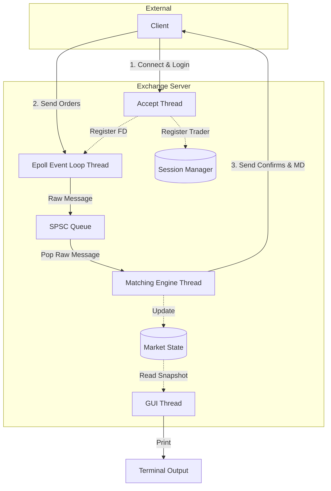

# Exchange Simulator

This is an exchange simulator server.

## Architecture

The exchange server is built using a multi-threaded architecture to ensure low latency and high throughput. It consists of four main threads communicating via shared memory and lock-free queues.



### Threads
- **Accept Thread**: Uses a TCP Server to accept incoming client connections, process login requests, and register active sockets with the epoll instance.
- **Epoll Event Loop (Main Thread)**: Asynchronously reads incoming network packets from all connected clients, frames the raw messages, and pushes them into a lock-free SPSC (Single Producer Single Consumer) queue.
- **Matching Engine Thread**: Pops raw messages from the SPSC queue, processes new/cancel/modify order requests using the `MatchingEngine`, updates the `MarketState`, and sends private order confirmations and public market data updates directly back to clients.
- **Terminal GUI Thread**: Periodically wakes up to read a snapshot of the `MarketState` and renders a live terminal dashboard showing the order book and trade information.

### Core Components
- **SPSC Queue**: A lock-free, single-producer, single-consumer queue that safely transfers framed messages from the network reading thread to the matching engine thread with minimal latency.
- **Epoll**: Used for efficient I/O multiplexing, allowing a single thread to handle data from many active client connections concurrently.
- **Matching Engine**: Core business logic that maintains limit order books for multiple symbols and matches incoming buy/sell orders.

## Compilation

To compile the code, open a terminal in the project directory and run:

```sh
mkdir build
cd build
cmake ..
make
```

## Running

After compiling, you can run the server using:

```sh
./build/exchange_server
```
